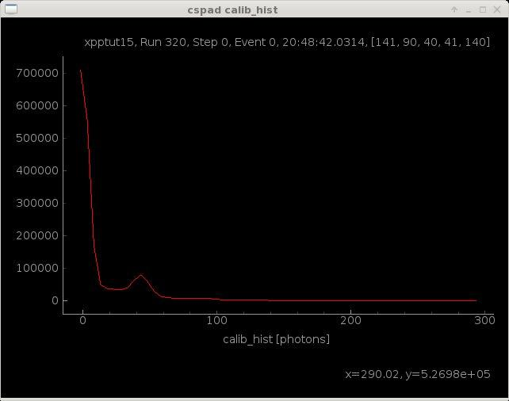

Count Photons
-------------
Using a threshold of 200 ADU, and assuming a gain of 35 ADU/photon (approximately at 9.5 keV for CsPad detectors), we can count the number of X-rays in the rings.  

.. sourcecode:: ipython

    In [7]: evt.cspad.add.count('calib', limits=(200,10000), gain=evt.cspad.gain, unit='photons', doc='Counts in rings')

Make a Histogram 
----------------

We can also histogram the number of photons in the pixels.  Using the same gain factor of 35 ADU/photon, the range of the calibrated cspad detector in high-gain mode is ~300 photons.  

.. sourcecode:: ipython

    In [8]: evt.cspad.add.histogram('calib', bins=range(-4,300,5), gain=evt.cspad.gain, unit='photons', doc='Gain corrected histogram', publish=True)
   
The publish keyword will open up the resulting histogram plot automatically.

Summarize Event Data
--------------------

Use the show_info method for a table of the event statistics.  Note that for statistical calulations like count and histogram, it is better to use the calib data instead of the reconstructed 2D image. 

.. sourcecode:: ipython

    In [9]: evt.cspad.show_info()
    Out[9]: 
    --------------------------------------------------------------------------------
    cspad xpptut15, Run 320, Step 0, Event 0, 20:48:42.0314, [141, 90, 40, 41, 140]
    --------------------------------------------------------------------------------
    calib                   <10.31> ADU     Calibrated data
    image                   <8.276> ADU     Reconstruced 2D image from calibStore geometry
    raw                 <1.579e+03> ADU     Raw data
    shape              (32, 185, 388)         Shape of raw data array
    size                    2296960         Total size of raw data
    --------------------------------------------------------------------------------
    User Defined Histograms:
    ------------------
    calib_hist          <3.248e+04> photons Gain corrected histogram
    --------------------------------------------------------------------------------
    Detector Counts:
    ------------------
    calib_count               30497 photons Counts in rings
    --------------------------------------------------------------------------------
    User Defined Parameters:
    ------------------
    gain                   0.028571         

